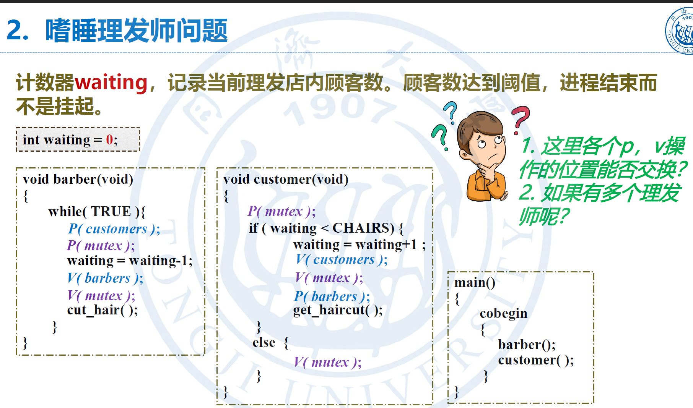
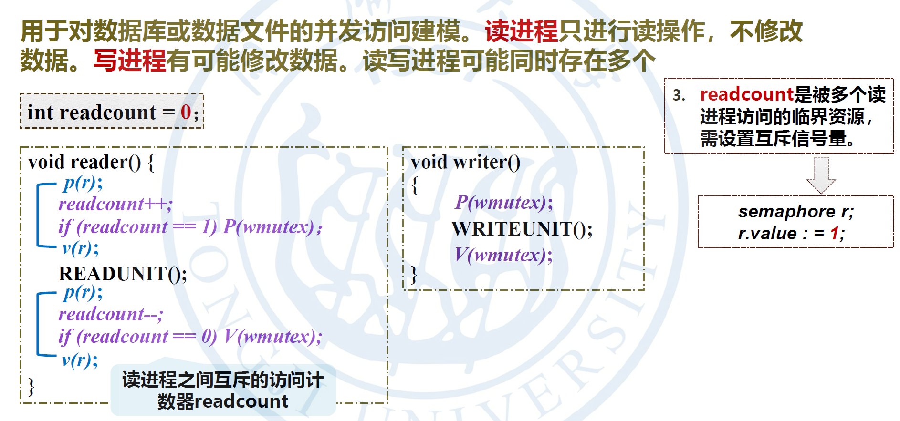
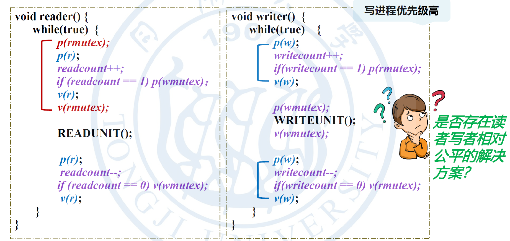

# 进程的同步与互斥
## 同步锁一定要在互斥锁之外
以`生产者-消费者`模型为例，假设我们有两个信号量，一个是`Mutex`(互斥锁)一个是`Empty`(同步信号量)，前者保证缓冲区有循序一个人同时操作，后者维护缓冲区的空位数量
### 假设互斥在外，同步在内————则容易发生死锁
比如此时缓冲区已满，`Empty`=0，则生产者`P(Mutex)`请求一个互斥锁，其他人无权访问缓冲区，然后生产者再`P(Empty)`请求一个空位，但是目前没有空位，所以只能睡觉，但是消费者又无权消费，导致死锁。


## 嗜睡理发师问题的P,V操作能否交换

首先`barbers`进程的P(customers)和P(mutex)是绝不能互换的，原因和之前说的一样，会产生死锁。
然后V(barbers)和V(mutex)交换是没问题的，作者此处把通知“理发师已准备好”的信号放在临界区里面，目的可能是强化这个整体是一个原子化的操作，waiting-1和“理发师已准备好”是作者想要的一个原语。
如果放在外面也完全没问题，即使刚释放锁就来了一个新顾客，直接导致waiting+1也没问题，因为后面的`P(barbers)`也需要等`V(barbers)`。
同理，customers进程的`V(customers)`和`V(mutex)`也可以交换。
并且，显然`P(barbers)`要在后面，因为按语义来讲，是明确顺序执行的


## 读者-写者问题
读者-写者是一个很经典的问题，在计算机的诸多领域都有应用，不论是并发编程还是编程语言方面，比如熟悉系统级语言的可能会想到rust的借用检查器，其核心就是可变引用不能和不可变引用共存，不能出现多个可变引用，和我们的读者-写者异曲同工。同样在cpp中也有类似的应用。

由于第一个读者进入，会给wmutex上锁，只要有读者进入写者就会被锁住，无法执行，可能导致写者“饥饿”，所以这种是`读者优先`。

写者优先，当一个写者进入之后，会给读者上锁`rmutex`，后续所有进入的读者只能睡眠

那到底有没有读者写者相对平衡的解决方案呢？其实是有的
我们可以添加一个队列信号量`semaphore queue = 1;`，无论是读者还是写者，想工作必须要`P(queue)`。
```
semaphore queue = 1;    // 新增排队信号量
semaphore rmutex = 1;   // 保护 readcount
semaphore wmutex = 1;   // 保护数据写入（写锁）
int readcount = 0;      // 读者计数
```

```
void reader() {
    while(TRUE) {
        P(queue);           
        P(rmutex);          // 准备修改计数器
        readcount++;
        if (readcount == 1) 
            P(wmutex);      // 第一个读者负责抢写锁
        V(rmutex);
        V(queue);           // 成功工作会释放队列锁

        READ_UNIT();        // 具体工作

        P(rmutex);
        readcount--;
        if (readcount == 0) 
            V(wmutex);      // 最后一个读者负责释放写锁
        V(rmutex);
    }
}
```

```
void writer() {
    while(TRUE) {
        P(queue);           // 
        P(wmutex);          // 抢写锁
        V(queue);           // 抢到写锁之后顺利工作，释放队列锁
        
        WRITE_UNIT();       // 写
        
        V(wmutex);          // 释放写锁
    }
}
```
实现了真正的FIFO先进先出
